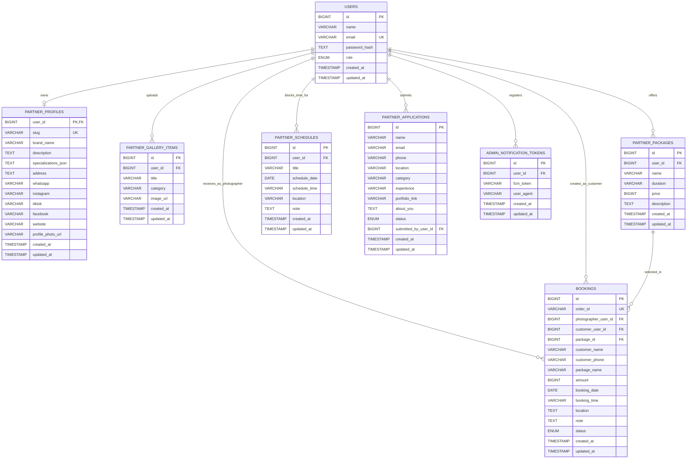

# AirisLens ERD

## Catatan

- Relasi di atas mengikuti kolom referensi yang dipakai aplikasi, walau sebagian belum dideklarasikan sebagai `FOREIGN KEY` di SQL.
- `BOOKINGS.package_name` disimpan sebagai snapshot nama paket saat transaksi dibuat, jadi tetap ada walaupun data paket berubah.
- `BOOKINGS.customer_user_id` dan `PARTNER_APPLICATIONS.submitted_by_user_id` bersifat opsional.
