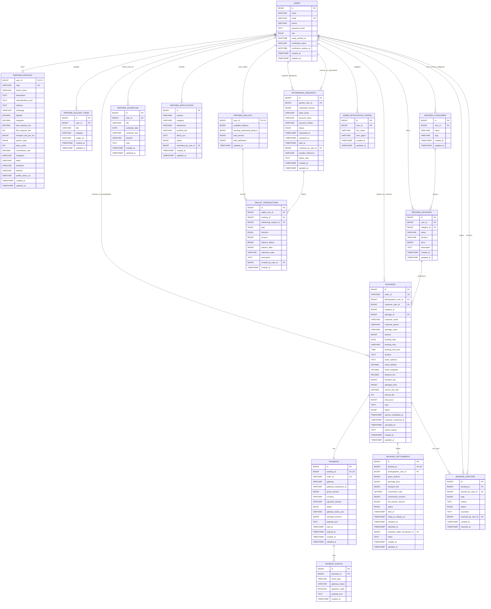

# AirisLens ERD

## Catatan

- ERD ini menunjukkan target akhir arsitektur escrow AirisLens, bukan hanya kondisi schema runtime saat ini.
- Foreign key fisik yang sudah diterapkan ke database live tetap dirujuk oleh migration `database/migrations/2026-06-24_02_add_foreign_keys.sql`.
- Refactor identitas `partner_applications` ke `users` dirujuk oleh migration `database/migrations/2026-06-25_01_refactor_partner_applications_identity.sql`.
- `PARTNER_APPLICATIONS` hanya menyimpan data khusus pengajuan partner. Nama, email, dan nomor telepon pemohon diambil dari `USERS` lewat relasi `submitted_by_user_id`.
- `USERS.email_verified_at` menandai kapan akun selesai verifikasi email. `verification_token` menyimpan hash token verifikasi aktif dan `verification_expires_at` menyimpan masa berlakunya.
- `PARTNER_PROFILES.partner_type` membedakan partner perorangan dan studio. `team_quota` menentukan berapa booking aktif yang masih bisa diterima di slot jam yang sama.
- `PARTNER_CATEGORIES` menyimpan katalog kategori layanan milik masing-masing fotografer, misalnya Wedding atau Prewedding.
- `PARTNER_PACKAGES.category_id` menghubungkan setiap paket ke kategori layanan yang dipilih fotografer.
- `PARTNER_PROFILES.commission_rate` adalah snapshot persentase komisi default untuk booking baru partner tersebut.
- `PARTNER_PROFILES.free_distance_km` dan `flat_transport_fee` dipakai untuk logika transportasi aktif. `transport_fee_per_km` sementara dipertahankan hanya untuk kompatibilitas data lama.
- `BOOKINGS.category_id` disimpan sebagai snapshot kategori layanan saat booking dibuat. Kolom ini sengaja diperlakukan sebagai snapshot transaksi dan tidak wajib selalu ikut foreign key fisik.
- `BOOKINGS.package_name` tetap disimpan sebagai snapshot nama paket saat transaksi dibuat.
- `BOOKINGS.location` dipertahankan untuk kompatibilitas sistem lama, sedangkan data lokasi acara baru disimpan juga di `event_address`, `event_latitude`, dan `event_longitude`.
- `PAYMENTS` adalah sumber kebenaran untuk status transaksi gateway, sedangkan `BOOKINGS.status` dipakai untuk status proses bisnis booking.
- `BOOKING_SETTLEMENTS` adalah lapisan escrow dan pembagian hasil antara AirisLens dan fotografer.
- `PARTNER_WALLETS` hanya menyimpan saldo ringkasan; audit trail utamanya ada di `WALLET_TRANSACTIONS`.
- Migration foundation escrow yang aman ditaruh di `database/migrations/2026-06-25_03_add_finance_foundation.sql`.
- Cutover enum `BOOKINGS.status` ke status bisnis final belum aman diterapkan ke runtime sebelum backend payment dan webhook direfactor.
